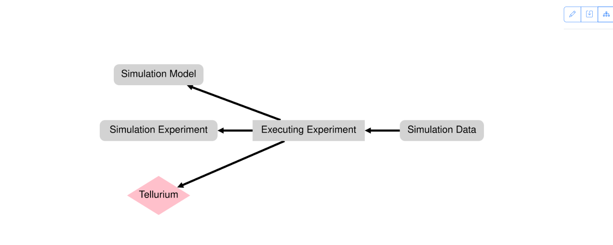

.. _extracting:

Extracting Provenance Information from an Event
------------------------------------------------

In the following, we use a running example to describe how the provenance information is extracted from an event.

Step 1 - Receiving an Event
^^^^^^^^^^^^^^^^^^^^^^^^^^^

After :ref:`starting the provenance builder <quickstart>`, it will listen by default under `localhost:5000/capturer/process-event` for incoming events.
An event represents a specific action or occurrence within a software system that is relevant for capturing provenance information.
It contains key-value pairs that provide details about the event, such as what action was performed, where it occurred, and additional context related to the action.

Here's an example of describing an event:

.. code-block:: json

    {
        "type" : "Experiment Executed",
        "executed_experiment" : "~/study/experiment.py",
        "experiment_specification" : "...",
        "with_model" : "~/study/my-model.mlr",
        "generated_data" : "~/study/exp1-results.csv",
        "tellurium_version" : "2.2.10",
        "model_specification" : "..."
    }

Step 2 - Applying the Corresponding Rule
^^^^^^^^^^^^^^^^^^^^^^^^^^^^^^^^^^^^^^^^
When an event is received, it is processed according to the rule defined for its ``type``.
This processing involves matching the event type to the corresponding rule function specified in the rule set.
SimProv then executes the rule function associated with the event type, passing the event data as input.

The rule function extracts relevant information from the event data and constructs a provenance activity object, which represents the modeler's activity in the simulation study.
This activity object includes entities, such as simulation models or data files, along with their attributes, and may also include agents responsible for the activity.

Once the activity object is constructed, it is returned by the rule function and used to update the provenance graph.

Here's an example of an rule for the event shown above:

.. include:: incl/rule.rst

.. warning::
    If an event type does not have a corresponding rule function defined, the event is rejected and added to the error log, ensuring that all events are processed consistently and accurately.

Step 3 - Match against the Provenance Pattern
^^^^^^^^^^^^^^^^^^^^^^^^^^^^^^^^^^^^^^^^^^^^^^
Finally, SimProv verifies the extracted provenance activity against the provenance patterns.
If any attribute values are missing or invalid entities/agents are assigned, the activity is logged as an error.
Otherwise, it is chained with the existing provenance graph.

To ensure chaining with the latest nodes, SimProv maintains an internal graph representation and a mapping for retrieval.
When a new activity is added:

    1. A new node is created for the activity.
    2. Connections are made to nodes representing entities used and agents associated.
    3. New nodes for generated entities are created and linked, updating the mapping.

If an entity or agent cannot be resolved, it is directly added to the graph and mapping.

Here's an example of a provenance pattern corresponding to the `Executing Experiment` activity:

.. include:: incl/pattern.rst

    Extracted provenance graph from the event.